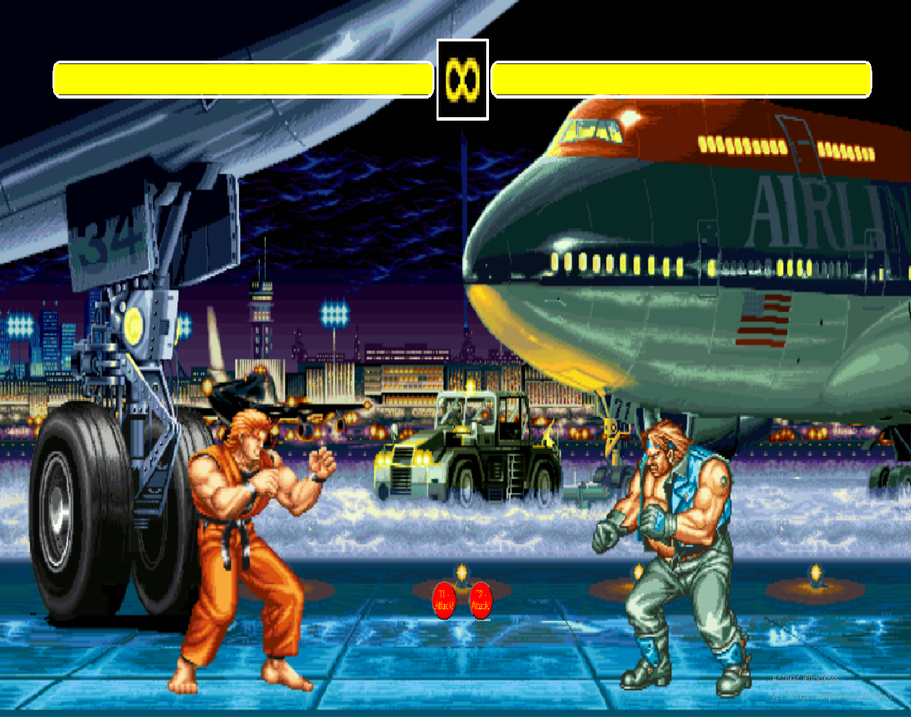

# Fighting Game (Art of fighting)

Tercer proyecto del Boocamp FullStck Developer de GeeksHubs Academy. 
Nos piden hacer un juego de lucha.

<h4> Requisitos.</h4>

<ul>
    <li>Menu de inicio/home</li>
    <li>Selección de personajes</li>
    <li>Pantalla de pelea</li>
    <li>Mostrar al ganador del juego</li>    
</ul>

Fecha de inicio: 10/05/2021
Fecha de fin: 16/05/2021

<h4>Desarrollo del proyecto</h4>
El proyecto realizado incluye una pantalla:
<ul>
    <li>Pantalla de bienvenida con el logo del juego</li>
    <li>Menú de selección de modo de juego</li>
    <li>Pantalla de selección de personajes</li>
    <li>Pantalla de selección de escenario</li>    
    <li>Pantalla de la pelea en el escenario escogido</li>
    <li>Pantalla de resultado de la pelea y boton para volver a jugar</li>
</ul>

<h4>Instrucciones</h4>
Elegiremos el modo de juego entre 1vs1 o Team Battle (3vs3). Una vez seleccionados pasaremos a la pantalla de elegir escenario. Cuando lo seleccionamos automáticamente nos lleva al escenario seleciconado para comenzar la pelea.
Hay dos botones, uno para cada luchador. Empieza el luchador que tenga en el atributo mayor velocidad. Cada vez ataca uno y produce un ataque aleatorio.
Cuando uno de los dos se queda sin energía, nos lleva a la pantalla que muestra el resultado de la pelea. Aquí tendremos la opción de volver al menú de selección de modo de juego para comenza de nuevo.

<h4>Estas han sido las tecnologías empleadas:</h4>
<ul>
    <li>HTML5</li>
    <li>CSS3</li>
    <li>JavaScript</li>
</ul>

<h4>Futuras versiones</h4>
<ul>
    <li>Implementación de ataque especial.</li>
    <li>Indicador de golpe especial activado cuando reciba o de X golpes.</li>
    <li>Implementación de movimiento mendiante las teclas.</li>
    <li>Que se golpeen cuando detecten que está cerca un jugador del otro</li>
</ul>

<h4>Ejemplo de pantalla de lucha del juego</h4>

   
Pedro AGulló Marco